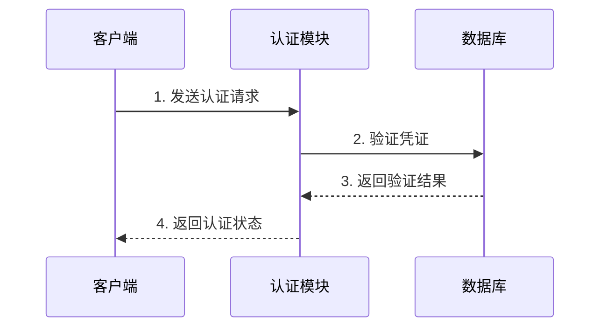

# 认证模块 (auth_module)

## 模块概述

auth_module 是 PFSS 的核心认证模块，负责：
1. 用户身份认证
2. 访问权限控制
3. secretKey 管理

## 认证流程



## 数据结构

### SecretKey
```typescript
interface SecretKey {
  id: string;         // 密钥ID
  key: string;        // 密钥内容
  createdAt: number;  // 创建时间
  expiresAt: number;  // 过期时间
  userId: string;     // 所属用户
  permissions: string[]; // 权限列表
}
```

### Token
```typescript
interface Token {
  token: string;      // JWT令牌
  type: string;       // 令牌类型
  expiresIn: number;  // 过期时间
}
```

## API接口

### 1. 生成 SecretKey
```http
POST /api/v1/auth/keys

Request:
{
  "validityDays": number,
  "permissions": string[]
}

Response:
{
  "secretKey": SecretKey
}
```

### 2. 删除 SecretKey
```http
DELETE /api/v1/auth/keys/{keyId}

Response:
{
  "success": boolean
}
```

### 3. 获取访问令牌
```http
POST /api/v1/auth/token

Request:
{
  "secretKey": string
}

Response:
{
  "token": Token
}
```

## 错误处理

| 错误码 | 描述 | 解决方案 |
|---------|------|----------|
| AUTH001 | 密钥无效 | 检查密钥是否过期或被删除 |
| AUTH002 | 权限不足 | 检查所需权限 |
| AUTH003 | 令牌过期 | 重新获取令牌 |

## 权限级别

1. 系统管理员
   - 全部权限
   - 可管理其他用户

2. 普通用户
   - 文件上传/下载
   - 管理自己的文件

3. 访客
   - 仅可下载/预览

## 安全建议

1. 定期轮换 SecretKey
2. 设置合理的密钥有效期
3. 遵循最小权限原则
4. 启用访问日志记录
5. 实现访问频率限制