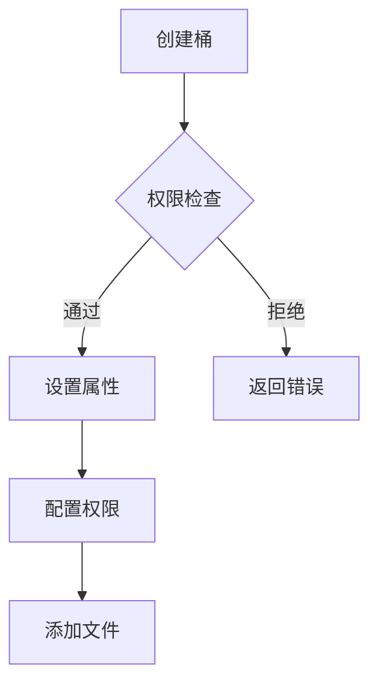

# 桶模块 (bucket_module)

## 模块概述

bucket_module 是 PFSS 的文件组织管理模块，通过桶（Bucket）的概念实现文件的逻辑分组和权限控制。

## 桶管理流程



## 数据结构

### 桶定义
```typescript
interface Bucket {
  id: string;         // 桶ID
  name: string;       // 桶名称
  fileIds: string[];  // 文件ID列表
  owner: string;      // 所有者
  createdAt: number;  // 创建时间
  updatedAt: number;  // 更新时间
  permissions: BucketPermission[]; // 权限配置
  metadata: Record<string, string>; // 自定义元数据
}
```

### 桶权限
```typescript
interface BucketPermission {
  userId: string;     // 用户ID
  access: "read" | "write" | "admin"; // 访问级别
  expiresAt?: number; // 过期时间
}
```

## API接口

### 1. 创建桶
```http
POST /api/v1/buckets

Request:
{
  "name": string,
  "permissions": BucketPermission[],
  "metadata": Record<string, string>
}

Response:
{
  "bucket": Bucket
}
```

### 2. 添加文件
```http
POST /api/v1/buckets/{bucketId}/files

Request:
{
  "fileIds": string[]
}

Response:
{
  "success": boolean
}
```

### 3. 更新桶权限
```http
PUT /api/v1/buckets/{bucketId}/permissions

Request:
{
  "permissions": BucketPermission[]
}

Response:
{
  "success": boolean
}
```

## 桶命名规范

1. 长度要求
   - 最少3个字符
   - 最多63个字符

2. 字符要求
   - 小写字母 a-z
   - 数字 0-9
   - 中划线 -

3. 命名规则
   - 必须以字母或数字开头
   - 不能以中划线结尾
   - 不能有连续的中划线

## 错误处理

| 错误码 | 描述 | 解决方案 |
|---------|------|----------|
| BUCKET001 | 桶名已存在 | 更换名称 |
| BUCKET002 | 权限不足 | 检查权限 |
| BUCKET003 | 桶不存在 | 验证ID |
| BUCKET004 | 命名不规范 | 参考命名规范 |

## 权限级别

1. 读取权限 (read)
   - 查看文件列表
   - 下载文件
   - 预览文件

2. 写入权限 (write)
   - 包含读取权限
   - 上传文件
   - 删除文件
   - 修改文件

3. 管理权限 (admin)
   - 包含写入权限
   - 管理桶权限
   - 修改桶属性

## 最佳实践

1. 桶的组织
   - 按业务类型划分
   - 避免嵌套过多
   - 保持结构清晰

2. 权限管理
   - 遵循最小权限原则
   - 定期审核权限
   - 及时撤销不需要的权限

3. 性能考虑
   - 控制单个桶的文件数量
   - 避免过多的权限检查
   - 使用缓存提高访问速度
