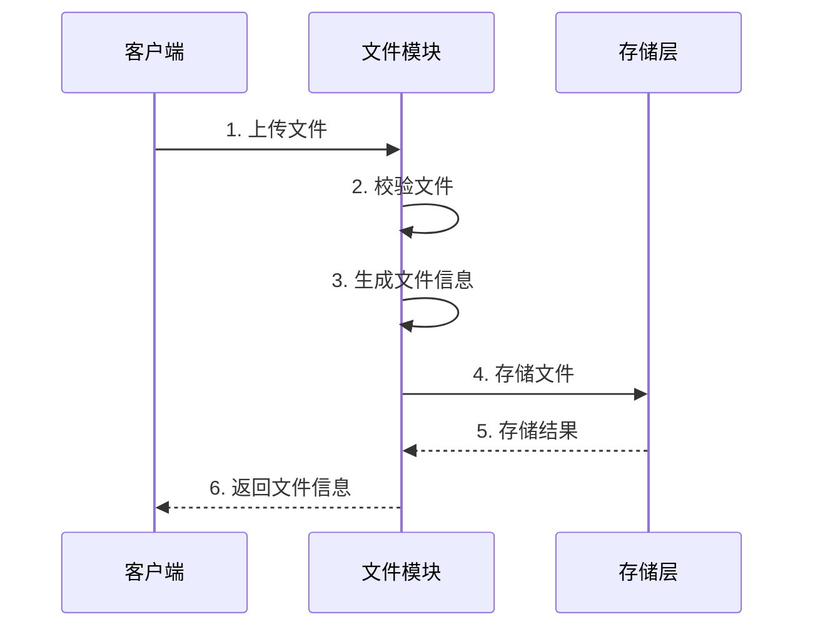

# 文件模块 (file_module)

## 模块概述

file_module 是 PFSS 的文件管理核心模块，负责文件的上传、预览、下载、删除等操作。

## 文件操作流程



## 数据结构

### 文件上传
```typescript
interface FileUpload {
  file: File;         // 文件对象
  customNameType?: "time" | "filename" | "hash"; // 命名策略
  customFolder?: string; // 自定义文件夹
  metadata?: Record<string, string>; // 自定义元数据
}
```

### 文件预览
```typescript
interface FilePreview {
  id: string;         // 文件ID
  name: string;       // 文件名
  path: string;       // 访问路径
  folder: string;     // 所在文件夹
  size: number;       // 文件大小
  type: string;       // 文件类型
  lastModified: number; // 最后修改时间
  previewUrl?: string; // 预览URL
}
```

### 文件元数据
```typescript
interface FileMetadata {
  id: string;         // 文件ID
  hash: string;       // 文件哈希
  encoding: string;   // 编码格式
  mimeType: string;   // MIME类型
  tags: string[];     // 标签
}
```

## API接口

### 1. 文件上传
```http
POST /api/v1/files
Content-Type: multipart/form-data

Request:
- file: File
- options: FileUpload

Response:
{
  "file": FilePreview
}
```

### 2. 文件下载
```http
GET /api/v1/files/{fileId}/download

Response: 文件流
```

### 3. 文件删除
```http
DELETE /api/v1/files/{fileId}

Response:
{
  "success": boolean
}
```

## 支持的文件类型

### 图片
- JPEG/JPG
- PNG
- GIF
- WebP
- SVG

### 文档
- PDF
- DOC/DOCX
- XLS/XLSX
- TXT
- Markdown

### 媒体
- MP4
- MP3
- WAV

## 文件命名规则

1. 时间戳命名
```
{timestamp}_{original_name}
```

2. 哈希命名
```
{sha256}_{extension}
```

3. 原始文件名
```
{original_name}
```

## 错误处理

| 错误码 | 描述 | 解决方案 |
|---------|------|----------|
| FILE001 | 文件过大 | 压缩或分块上传 |
| FILE002 | 格式不支持 | 检查支持的格式 |
| FILE003 | 存储空间不足 | 清理旧文件 |
| FILE004 | 文件损坏 | 重新上传 |

## 性能优化

1. 分块上传
   - 支持大文件上传
   - 断点续传
   - 并发上传

2. 文件缓存
   - 使用 Redis 缓存元数据
   - CDN 缓存静态文件

3. 压缩策略
   - 自动压缩大文件
   - 图片自动转换

## 安全措施

1. 文件扫描
   - 病毒检测
   - 敏感信息识别

2. 访问控制
   - 文件级别权限
   - 链接过期控制

3. 存储加密
   - 文件加密存储
   - 传输加密
