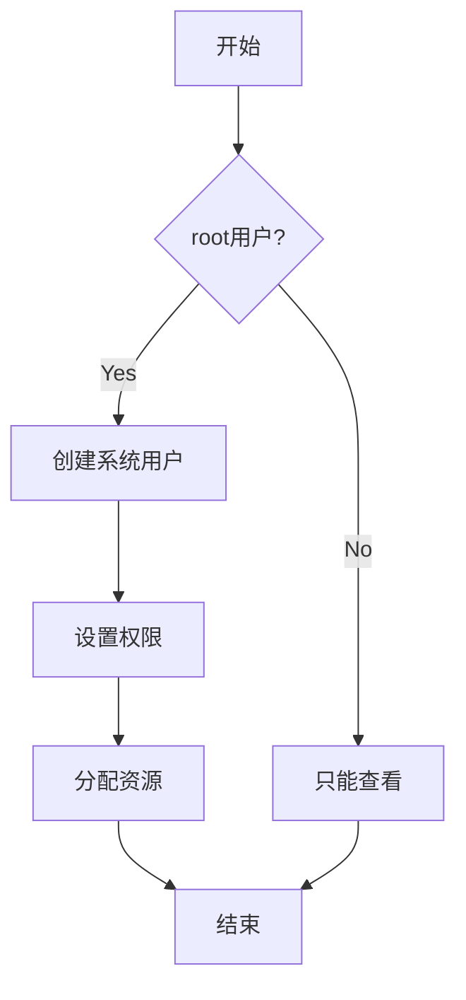

# 用户模块 (user_module)

## 模块概述

user_module 是 PFSS 的用户管理模块，负责用户的创建、认证和权限管理。

## 用户类型

1. 系统用户（SystemUser）
   - 在部署服务器上注册
   - 具有完整的管理权限
   - 可以管理文件和桶

2. 可访问性用户（AccessUser）
   - 通过互联网访问
   - 仅有读取权限
   - 不需要注册

## 用户管理流程



## 数据结构

### 系统用户
```typescript
interface SystemUser {
  id: string;         // 用户ID
  username: string;   // 用户名
  password: string;   // 密码（加密存储）
  createdAt: number;  // 创建时间
  isRootUser: boolean;// 是否为超级管理员
  status: string;     // 用户状态
  permissions: string[]; // 权限列表
}
```

### 用户权限
```typescript
interface UserPermission {
  userId: string;     // 用户ID
  resource: string;   // 资源类型
  action: string;    // 操作类型
  constraints: any;  // 限制条件
}
```

## API接口

### 1. 创建用户
```http
POST /api/v1/users

Request:
{
  "username": string,
  "password": string,
  "permissions": string[]
}

Response:
{
  "user": SystemUser
}
```

### 2. 用户登录
```http
POST /api/v1/users/login

Request:
{
  "username": string,
  "password": string
}

Response:
{
  "token": string,
  "user": SystemUser
}
```

### 3. 修改用户权限
```http
PUT /api/v1/users/{userId}/permissions

Request:
{
  "permissions": string[]
}

Response:
{
  "success": boolean
}
```

## 用户状态

| 状态 | 描述 | 可用操作 |
|---------|------|----------|
| ACTIVE | 正常状态 | 全部功能 |
| LOCKED | 账户锁定 | 仅可查看 |
| DISABLED | 账户禁用 | 无权限 |

## 权限管理

### 基本权限
- READ: 读取文件
- WRITE: 写入文件
- DELETE: 删除文件
- ADMIN: 管理权限

### 特殊权限
- ROOT: 超级管理员权限
- BUCKET_ADMIN: 桶管理权限

## 安全建议

1. 定期修改密码
2. 启用多因素认证
3. 设置密码复杂度要求
4. 记录用户操作日志
5. 实现账户锁定机制
