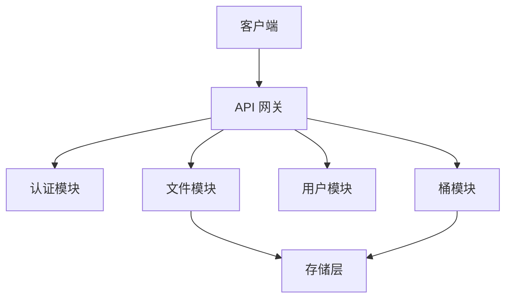

# 私人文件存储服务 (PFSS)

## 简介

私人文件存储服务（PFSS）是一个轻量级的文件存储和管理系统，专为开发者和中小企业设计。它提供安全可靠的文件存储、管理和访问功能，支持独立部署。

## 系统架构



## 核心功能

### 1. 文件管理
- 文件上传（支持多种命名策略）
- 文件预览（Web端直接预览）
- 文件下载
- 文件删除和修改

### 2. 桶管理
- 自定义存储路径
- 桶级别的访问控制
- 文件组织和分类

### 3. 安全特性
- 私有上传（基于密钥）
- 可配置的公开访问
- 用户权限管理

## API 示例

### 文件上传
```bash
curl -X POST 'http://localhost:8080/api/v1/files/upload' \
  -H 'Authorization: Bearer YOUR_SECRET_KEY' \
  -F 'file=@/path/to/file.jpg' \
  -F 'customNameType=time' \
  -F 'customFolder=images'
```

### 文件下载
```bash
curl -X GET 'http://localhost:8080/api/v1/files/download/{fileId}' \
```

## 错误处理

| 状态码 | 说明 | 处理建议 |
|--------|------|----------|
| 400 | 请求参数错误 | 检查请求参数 |
| 401 | 未授权 | 检查认证信息 |
| 403 | 无权限 | 确认操作权限 |
| 404 | 资源不存在 | 检查资源ID |
| 413 | 文件过大 | 检查文件大小限制 |

## 数据结构

### 文件
```typescript
interface File {
  id: string;         // 文件唯一标识
  name: string;       // 文件名
  path: string;       // 存储路径
  bucketId: string;   // 所属桶ID
  size: number;       // 文件大小(字节)
  type: string;       // MIME类型
  lastModified: number; // 最后修改时间
  hash: string;       // 文件哈希值
}
```

### 桶
```typescript
interface Bucket {
  id: string;         // 桶唯一标识
  name: string;       // 桶名称
  fileIds: string[];  // 文件ID列表
  createdAt: number;  // 创建时间
  owner: string;      // 所有者ID
}
```

## 限制说明

- 最大文件大小：100MB
- 支持的文件类型：所有常见文件类型
- 桶命名规则：小写字母、数字、中划线，3-63字符
- API速率限制：100次/分钟
